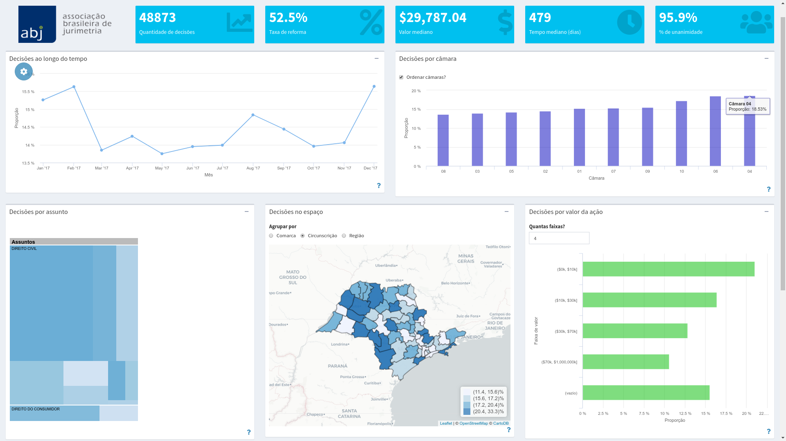
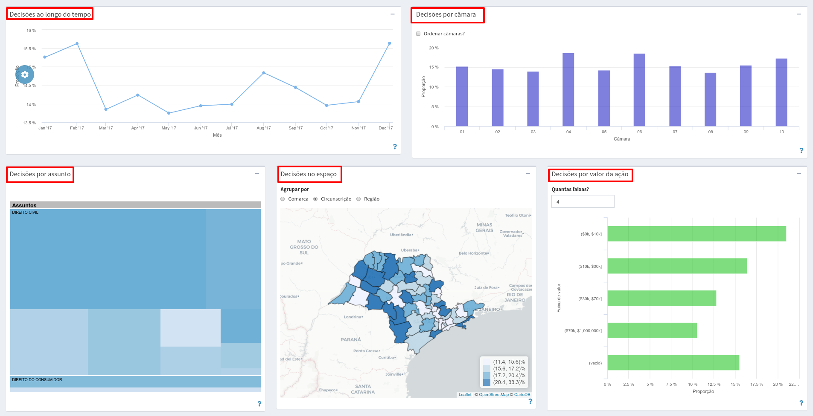
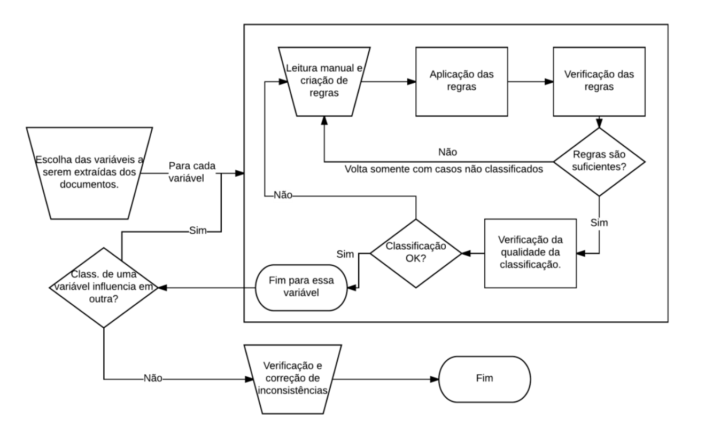

```{r setup, include=FALSE}
library(flexdashboard)
```

Sobre
=======================================================================

Row
-----------------------------------------------------------------------

### Ainda não é associado?

O Boletim é uma ferramenta disponibilizada para os associados da ABJ. Você pode se associar clicando no botão abaixo:

<div align="center">
<a href="https://abj.org.br/associe-se"><button>Associe-se</button></a>
</div>


Row {data-height: 500px}  
-----------------------------------------------------------------------

### Entenda o Boletim

A Jurimetria é a área do conhecimento que utiliza a estatística para elucidar fenômenos jurídicos. Dentre as aplicações mais comuns da jurimetria, destacam-se a avaliação o impacto de políticas públicas e o aprimoramento a tomada de decisão em processos judiciais.

No mundo real existem diversos entraves que dificultam a aplicação da **Jurimetria**. O principal deles está na forma em que os dados estão organizados no judiciário: apesar dos dados serem públicos, eles são de difícil acesso e são disponibilizados em formatos impróprios para análise estatística.

Ao longo da história da Associação Brasileira de Jurimetria (ABJ), desenvolvemos uma série de ferramentas para lidar com esse problema. Essas ferramentas foram construídas em consonância com os objetivos estatutários da ABJ, isto é, disseminar e facilitar o uso da Jurimetria na prática.

O Boletim da ABJ é um importante passo que foi dado nesse sentido. Tratam-se de dois produtos: i) uma base de dados organizada da jurisprudência dos tribunais e ii) um *dashboard* interativo que permite a realização de algumas análises de forma intuitiva. As bases de dados serão aprimoradas continuamente para contemplar mais estados da federação e informações mais precisas.

<div>
```{r, out.width="80%", fig.align='center'}

```
</div>


<!-- O Boletim da ABJ é uma ferramenta exclusiva para associados. No entanto, você pode acessar uma prévia das informações [neste link](). -->

### Como funciona?

Em resumo, o Boletim é formado por três componentes: 

1. A **variável resposta**, que é o dado que queremos analisar, como taxa de reforma ou tempo do processo.

<div>
```{r out.width="25%", fig.align='center'}
knitr::include_graphics("../img/variavel-resposta.png")
```
</div>

2. As **variáveis explicativas**, que são características utilizadas para segmentar os resultados, como câmara, comarca de origem, etc.

<div>
```{r out.width="80%", fig.align='center'}

```
</div>

3. Os **filtros**, que são formas de acessar os resultados apenas para determinado subconjunto da base.

<div>
```{r out.width="25%", fig.align='center'}

```
</div>


Cada quadro do Boletim busca quebrar os resultados a partir de uma variável explicativa específica. Por exemplo, no quadro das câmaras, é possível entender quais câmaras criminais do TJSP produzem as maiores maior taxa de reforma ou maiores tempos medianos.

A seleção da variável resposta e a seleção de filtros pode ser realizada no menu lateral da esquerda do Boletim. Por exemplo, é possível selecionar como resposta a taxa de reforma ou o tempo, e é possível escolher as áreas cível ou criminal.

Nem todos os cruzamentos podem ser realizados utilizando-se o *dashboard* interativo. Por isso, também disponibilizamos aos nossos associados a base de dados completa, para dar total liberdade ao pesquisador.

Projetos da ABJ {.storyboard}
========================================================================

### Clique nos links para acessar a lista de projetos já realizados pela ABJ {style="min-height:750px;"}

```{r}
plot(cars)
```

***

<div style="min-height:750px">
Utilizando como base informações similares ao Boletim da ABJ, já realizamos diversos projetos, com o intuito de mostrar o poder da Jurimetria, aprimorar a prestação jurisdicional e sugerir boas políticas públicas. 
</div>

### Maiores Litigantes na Justiça Consumerista: mapeamentos e proposições {style="min-height:750px;"}

```{r}
plot(1:10)
```

***

<div style="min-height:750px">
Estudos anteriores indicavam que ações envolvendo o direito do consumidor têm grande influência no volume de processos no Poder Judiciário, com mais de dois milhões de casos novos envolvendo responsabilidade do fornecedor ou indenização por dano moral, situando o assunto como o terceiro mais demandado de todos os tribunais. Isto posto, compreender o volume e o perfil dos processos que envolvem direito do consumidor é condição necessária para uma boa administração da Justiça. Dentro do contexto de direito do consumidor, a pesquisa foi criada em torno em duas perguntas principais: a) o que fazer com o estoque atual de processos? e b) como evitar a entrada de tantos processos?. Descrevemos a metodologia do estudo para obtenção dos maiores litigantes e mostramos os principais resultados da pesquisa.
</div>

### Tempo dos processos relacionados à adoção no Brasil {style="min-height:750px;"}

```{r}
plot(1:10)
```

***

<div style="min-height:750px">
A pesquisa foi usada como instrumento para conhecer com maior profundidade os processos relacionados à adoção e para identificar entraves legais, administrativos e judiciais. Finalizamos com orientações de políticas públicas de qualidade e medidas concretas do Judiciário.

As bases de dados utilizadas no decorrer da pesquisa vieram de duas fontes principais: (i) Extrações das bases de dados e (ii) Informações preenchidas pelos próprios pesquisadores. Tratam-se dos questionários utilizados nas entrevistas com especialistas e o formulário de classificação processual.
</div>


### Estudo sobre varas empresariais na Comarca de São Paulo {style="min-height:750px;"}

```{r}
plot(1:10)
```

***

<div style="min-height:750px">
A especialização de varas é um tema de interesse na administração do judiciário. Atualmente, os poucos estudos disponíveis fazem muitas suposições para chegar às conclusões ou esbarram em dificuldades impostas pela documentação dos dados. Nesse estudo, discutimos a criação de varas empresariais na Comarca de São Paulo e desenvolvemos metodologias inovadoras para resolver três problemas. O primeiro é a vinculação de normas para determinação de competências com assuntos da Tabela Processual Unificada do CNJ (Res. 46). O segundo é o tratamento de falhas na classificação dos assuntos na base de dados analisada. O terceiro é criar uma métrica de mensuração e comparação dos esforços empreendidos por magistrados em processos comuns e empresariais. Nas análises realizadas, encontramos evidências de que um processo empresarial demanda aproximadamente o dobro de esforço do que um processo comum. Ao realizar correções no volume processual a partir de um modelo de tratamento dos assuntos, concluímos que duas varas empresariais atendem adequadamente a demanda existente nos termos da resolução Nº 02/2011 do TJSP.
</div>

### O Processamento de Homicídios no Brasil {style="min-height:750px;"}

```{r}
plot(1:10)
```

***

<div style="min-height:750px">
Este trabalho avaliou o impacto da ENASP no processamento de homicídios no Brasil utilizando metodologias qualitativas e quantitativas aplicadas aos estados de Alagoas, Santa Catarina e São Paulo, e metodologias qualitativas aplicadas ao âmbito federal. Os resultados indicaram que o impacto da ENASP no processamento de homicídios no país foi diverso entre os estados. A metodologia utilizada mesclou dois métodos qualitativos e dois quantitativos que se complementam: i.1) entrevistas com gestores e operadores da ENASP, i.2) análise dos relatórios e documentos produzidos pela equipe da ENASP, ii.1) análise de uma amostra de processos de homicídios da comarca de São Paulo e ii.2) análise de dados gerais de amostras ou da totalidade de processos de homicídio que tramitaram nos estados de Alagoas, Santa Catarina e São Paulo entre 2009 e 2015. A parte quantitativa implicou em relevantes avanços metodológicos para análise de tempos processuais.

Em relação ao cumprimento das metas, o resultado foi considerado ruim. No entanto, foi possível identificar uma redução sistemática nos tempos medianos de algumas fases processuais. Além disso, a iniciativa promoveu um diagnóstico do estoque de processos de homicídios e dificuldades estruturais, além de ter incentivado a articulação das entidades envolvidas, colaborando para uma visão mais unificada sobre a temática da investigação e processamento de homicídios, resultando em ganhos permanentes.
</div>

### Observatório da insolvência {style="min-height:750px;"}

```{r}
plot(1:10)
```

***

<div style="min-height:750px">
O trabalho teve como objetivos auxiliar na elaboração e alteração de leis sobre o tema e compreender empiricamente o processo de Recuperação Judicial, incluindo:

O que influencia no deferimento e quanto tempo ele leva?
O que acontece entre deferimento e aprovação do plano?
Quais são as características gerais dos planos de recuperação aprovados?

O trabalho tratou-se da primeira análise exaustiva sobre processos de recuperação judicial da comarca de São Paulo.
</div>

Dashboard
=======================================================================

Row
-----------------------------------------------------------------------

<iframe src="https://boletim.abj.org.br/" width="100%" height="1000" style="margin:0;border:0;"></iframe>

Dados
=======================================================================

Row
-----------------------------------------------------------------------

### Bases de dados

<table><tr><td>
Até o momento, a base de dados do boletim contempla as decisões colegiadas de segundo grau do TJSP, registradas entre 01/01/2017 e 31/12/2018. Essas decisões são inicialmente listadas a partir da Consulta de Julgados de Segundo Grau (CJSG) e posteriormente pesquisadas na Consulta de Processos de Segundo Grau (CPOSG). 

Os dados brutos, em formato HTML, são transformados em dados analíticos, após diversas etapas de arrumação e limpeza de dados. No final, temos uma tabela única em que cada linha é um número de processo e cada coluna é uma informação desse processo.

Para montar o dashboard, retiramos uma parte dos processos que não atendiam às nossas regras de inclusão/exclusão. Por isso, disponibilizamos duas bases de dados para download: a "base completa", que contém todas as informações e a "base dashboard", que contém os dados que alimentam a ferramenta.
</td><td>



</td>
</tr>
</table>

Row
-----------------------------------------------------------------------

### Base dashboard

A base de dados do dashboard contempla as seguintes colunas:

- Classes: Apelação, Agravo de Execução Penal, Agravo de Instrumento, Habeas Corpus, Mandado de Segurança, Recurso em Sentido Estrito.
- Assuntos: DIREITO CIVIL, DIREITO PENAL, DIREITO DO CONSUMIDOR, DIREITO PREVIDENCIÁRIO, DIREITO TRIBUTÁRIO.
- Decisões: Apenas decisões com provimento, improvimento ou parcial provimento.
- Datas: Decisões proferidas entre Janeiro/2017 e Dezembro/2017.
- Câmaras: Apenas Ordinárias, considerando 01-38 Câmaras de Direito Privado e 01-16 Câmaras Criminais.
- Outros: Outros filtros específicos (nos casos criminais, apenas recursos sem valor da causa; recursos com comarca de origem definida, etc).

<div align="center">
<a href="https://abj.org.br/associe-se"><button>Baixar Base Dashboard</button></a>
</div>


### Base completa

A base de dados completa possui todas as colunas da base dashboard, e mais algumas adicionais:

- **Texto da decisão** (`dec_txt`): texto original de onde foi extraída a coluna `dec_val`. 
- 

<div align="center">
<a href="https://abj.org.br/associe-se"><button>Baixar Base Completa</button></a>
</div>

Prévia
=======================================================================

```{r}
# library(tidyverse)
library(magrittr)
library(shiny)
library(htmltools)
library(tidyverse)
library(highcharter)
library(leaflet)
library(scales)
library(formattable)
library(bsselectR)
dados <- "../data/da_boletim.fst" %>% 
  fst::read_fst() %>% 
  dplyr::filter(info_classe == "Apelação", info_area == "Família")

devtools::load_all("~/Documents/boletim")
```

Inputs {.sidebar data-width=300}
-----------------------------------------------------------------------

```{r}
assuntos_pai <- c("DIREITO CIVIL", 
                  "DIREITO PENAL", 
                  "DIREITO DO CONSUMIDOR",
                  "DIREITO PREVIDENCIÁRIO",
                  "DIREITO TRIBUTÁRIO")
areas <- c("Privado 1: Câmaras 01-11" = "Família",
           "Privado 2: Câmaras 12-29" = "Contratos",
           "Privado 3: Câmaras 30-38" = "Imobiliário",
           "Criminal" = "Criminal")
resp <- c("Decisões favoráveis" = "aceitou",
          # "Decisões parcialmente favoráveis" = "parcial",
          "Reforma (parcial + favorável)" = "reforma",
          "Unanimidade" = "unanime", 
          "Tempo" = "time_clean")
resp_tipo_cat <- c("Proporção" = "prop", "Valores absolutos" = "n")
resp_tipo_val <- c("Valor mediano" = "median", "Valor médio" = "mean")

classes_writ <- c("Mandado de Segurança", "Habeas Corpus", "Revisão Criminal")
classes_recurso <- c("Apelação", "Agravo de Execução Penal", "Recurso em Sentido Estrito")
classes_privado <- c("Apelação", "Agravo de Instrumento")
classes_tot <- unique(c(classes_writ, classes_recurso, classes_privado))

tipo_litigio <- c("Física vs Física" = "PF-PF", 
                  "Física vs não Física" = "PF-nPF", 
                  "Não Física vs não Física" = "nPF-PF", 
                  "Não Física vs não Física" = "nPF-nPF")

regioes <- c("Comarca" = "com", "Circunscrição" = "cir", "Região" = "reg")
```


### O quê

<div style="max-height:50px">
```{r}
bsselect(map_chr(resp, ~""))
```
</div>

### Como

<div style="max-height:50px">
```{r}
bsselect(map_chr(resp_tipo_cat, ~""))
```
</div>

### Área 

<div style="max-height:50px">
```{r}
bsselect(map_chr(areas, ~""))
```
</div>

### Classe

<div style="max-height:50px">
```{r}
bsselect(map_chr(purrr::set_names(classes_privado), ~""))
```
</div>

### Mais

Para carregar o dashboard com essas informações você precisa ser um associado da ABJ. Acesse [aqui](https://abj.org.br/associe-se) para mais detalhes.

Row 
-----------------------------------------------------------------------

### {.value-box}

```{r}
valueBox("48.873", "Quantidade de decisões", "fa-chart-line", color = "primary")
```

### {.value-box}

```{r}
valueBox("52,5%", "Taxa de reforma", "fa-percent", color = "primary")
```

### {.value-box}

```{r}
valueBox("R$ 27.787,04", "Valor mediano", "fa-dollar-sign", color = "primary")
```

### {.value-box}

```{r}
valueBox(479, "Tempo mediano (dias)", "fa-clock", color = "primary")
```


### {.value-box}

```{r}
valueBox("95,9%", "% de unanimidade", "fa-users", color = "primary")
```

Row 
-----------------------------------------------------------------------

### No tempo

```{r}
gerar_graf_tempo(dados, "reforma", "prop", "sum")
```


### Por câmara

```{r}
gerar_graf_camara(dados, "reforma", "prop", "sum")
```

Row
-----------------------------------------------------------------------

### Por assunto

```{r}
gerar_sunburst_assuntos(dados)
```


### No espaço

```{r}
gerar_mapa_processo <- function(tabela, map_desfecho, map_tipo, nivel, fun) {
  load("../data/mapas.rda")
  load("../data/depara.rda")
  obj <- switch(nivel, "reg" = sf_reg, "cir" = sf_cir, "com" = sf_com)
  agrupar_por <- switch(nivel, 
    "reg" = "regiao", 
    "cir" = "circunscricao",
    "com" = "comarca")
  
  grp <- sym(agrupar_por)
  desf <- sym(map_desfecho)
  
  f <- switch(fun, "sum" = sum, "median" = median, "mean" = mean)
  
  map_data <- tabela %>% 
    inner_join(mutate(depara, comarca2 = comarca), 
               c("info_comarca" = "comarca2")) %>% 
    group_by(!!grp) %>% 
    summarise(tot = n(), n = f(!!desf))
  
  map_data[[map_tipo]] <- map_data[["n"]]
  
  map_data <- map_data %>% 
    mutate(prop = n / tot) %>% 
    inner_join(obj, agrupar_por)
  
  # gerador de labels
  bins <- unique(quantile(map_data[[map_tipo]]))
  pal <- colorBin("Blues", domain = map_data[[map_tipo]], bins = bins)
  label_format <- labelFormat()
  if (map_tipo == "prop") {
    label_format <- labelFormat(
      prefix = "(", suffix = ")%", between = ", ",
      transform = function(x) round(100 * x, 1)
    )
  }
  labels <- purrr::map(seq_len(nrow(map_data)), ~{
    z <- map_data[[map_tipo]][.x]
    if (z < 1) z <- scales::percent(z)
    htmltools::HTML(stringr::str_glue(
      "{map_data[[agrupar_por]][.x]}<br/>{z}"
    ))
  })
  
  map_data %>% 
    sf::st_as_sf() %>% 
    leaflet(options = leafletOptions(zoomControl = FALSE)) %>% 
    addProviderTiles(providers$CartoDB.Positron) %>% 
    addPolygons(weight = 1.6, 
                color = "black",
                fillOpacity = 0.9,
                fillColor = pal(map_data[[map_tipo]]),
                label = labels) %>% 
    addLegend(pal = pal, 
              values = map_data[[map_tipo]], 
              opacity = 0.7, 
              title = NULL,
              labFormat = label_format,
              position = "bottomright")
  
}
gerar_mapa_processo(dados, "reforma", "prop", "reg", "sum")
```


### Por valor

```{r}
gerar_graf_valor(dados, "reforma", "prop", "sum", n_faixas = 4)
```


Row
-----------------------------------------------------------------------

### Partes

```{r}
montar_dt(gerar_graf_litig(dados)[["PF-nPF"]])
```

### Magistrados

```{r}
gerar_graf_relator(dados)
```

Contato
=======================================================================

Row
-----------------------------------------------------------------------

### Contato

O Boletim ABJ uma ferramenta interativa da Associação Brasileira de Jurimetria, disponibilizada somente para associados, que divulga indicadores sobre a atuação dos Tribunais de Justiça brasileiros, entre outras métricas que nos julgarmos capazes de apresentar e discutir. Todos os textos, tabelas e gráficos são de responsabilidade da ABJ e sofrerão alterações continuamente. Se tiver dúvidas, sugestões ou encontrar erros, envie um e-mail para [relacionamento@abj.org.br](mailto:relacionamento@abj.org.br), com o assunto [BOLETIM].